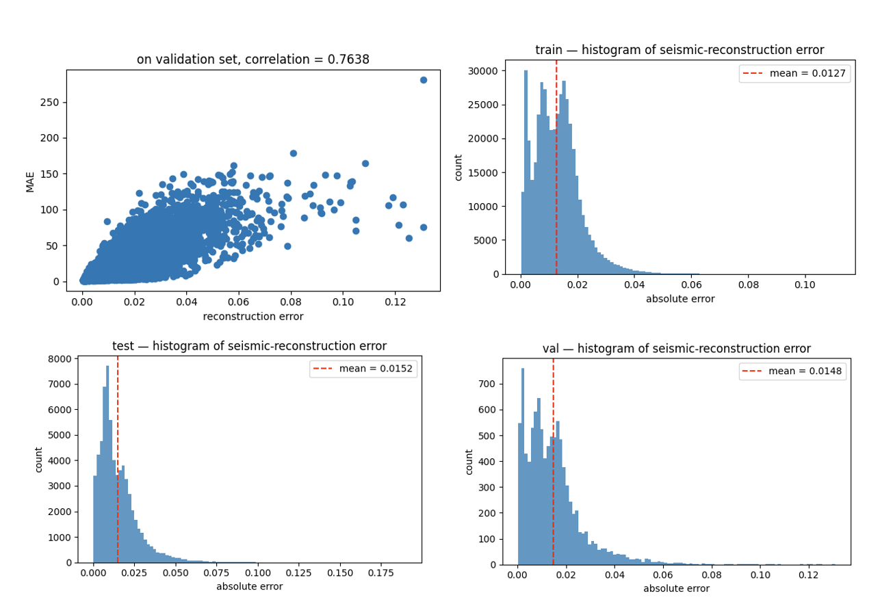

## cuda_vel_forward

- cuda speed up for waveform-inversion-vel-to-seis and some findings
- (500, 1, 70, 70) --> (500, 5, 1000, 70): about 1min on RTX 5090

---

ref: 
- https://csim.kaust.edu.sa/files/SeismicInversion/Chapter.FD/lab.FD2.8/lab.html
- https://www.kaggle.com/code/jaewook704/waveform-inversion-vel-to-seis

## usage
```shell
python setup.py install
```

```python
from cuda_vel_forward import Vel_Forward
...
# B, 1, 70, 70
lbl = torch.from_numpy(lbl).float()
a = Vel_Forward()

# B, 5, 1000,70
gen_arr = a(lbl).cpu().numpy()
```

## notes
MAE与重建误差非常相关，在验证集达到了 0.76的皮尔逊相关系数
这可以指导训练，例如伴随训练一个Reward Model

